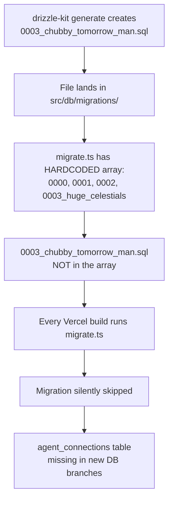

# Root Cause Analysis: Missed Migration in Production

## Incident Summary

Migration `0003_chubby_tomorrow_man.sql` (creates the `agent_connections` table) was generated by `drizzle-kit` and placed in `src/db/migrations/`, but was **never executed in production** because `src/db/migrate.ts` uses a hardcoded array of migration filenames that wasn't updated.

## What Happened

### The Failure Chain



### Why It Didn't Catch Fire Immediately

The production Neon database already had the `agent_connections` table because it was created via `drizzle-kit push` during local development. The migration system is supposed to be the source of truth for new branches and clean deployments, but the hardcoded array meant new Neon branches (previews, staging) would be missing this table.

### Timeline

1. Schema change added `agent_connections` to `src/db/schema.ts`
2. `drizzle-kit generate` created `0003_chubby_tomorrow_man.sql`
3. Developer ran `drizzle-kit push` locally (applied directly to prod DB)
4. **Nobody updated the `MIGRATIONS` array in `migrate.ts`**
5. All subsequent deployments ran migrations but silently skipped the new file
6. Preview deployments on Neon branches failed with DB query errors on `agent_connections`

## Root Cause

**A manual, error-prone step was required to keep two sources of truth in sync:**
- The `src/db/migrations/` directory (files generated by drizzle-kit)
- The `MIGRATIONS` array in `src/db/migrate.ts` (hardcoded filenames)

This violates the DRY principle. The migration directory IS the source of truth — the hardcoded array is a redundant copy that drifts.

## The Fix (PR [#43](https://github.com/kyesh/fine_grain_access_control/pull/43))

Replace the hardcoded array with dynamic directory scanning:

```diff
-const MIGRATIONS = [
-  '0000_redundant_night_nurse.sql',
-  '0001_multi_key_multi_email.sql',
-  '0002_email_delegations.sql',
-  '0003_huge_celestials.sql',
-];
+const migrationsDir = join(process.cwd(), 'src', 'db', 'migrations');
+const MIGRATIONS = existsSync(migrationsDir)
+  ? readdirSync(migrationsDir).filter(file => file.endsWith('.sql')).sort()
+  : [];
```

This ensures every `.sql` file in the migrations directory is automatically picked up and executed in order.

## Conflict Check with PR #42

| | PR #42 (cli-token-auth) | PR #43 (migrate fix) |
|---|---|---|
| **Files** | `src/app/api/auth/cli-token/route.ts`, `src/app/api/mcp/route.ts` | `src/db/migrate.ts` |
| **Conflict** | ❌ None | ❌ None |

The two PRs touch completely separate files and can merge independently.

## Mitigation: How to Prevent This in the Future

> [!IMPORTANT]
> Three systemic changes should be made:

### 1. CI Validation (Automated)
Add a CI check that verifies every `.sql` file in `src/db/migrations/` would be executed by `migrate.ts`. If the migration runner uses a hardcoded list, CI should fail when there's a mismatch. **With PR #43's fix (dynamic loading), this becomes unnecessary.**

### 2. Agent Rule Update (Process)
Update `.agent/rules/database.md` to add:

```markdown
7. **Migration File Tracking**: After running `drizzle-kit generate`, verify the new migration file appears in `migrate.ts`. If `migrate.ts` uses dynamic directory loading, verify the file has a `.sql` extension and is in the correct directory. Run `npm run db:migrate` locally to confirm.
```

### 3. Build-Time Assertion (Defense in Depth)
Add a build-time check in `migrate.ts` that logs a warning if zero migrations are found, and errors if the migrations directory doesn't exist:

```typescript
if (MIGRATIONS.length === 0) {
  console.warn('⚠️  No migration files found in', migrationsDir);
}
```

### 4. Schema-DB Drift Detection
Add a post-migration step that runs `drizzle-kit check` or compares the schema against the live DB to detect drift. This catches cases where the schema file has tables/columns that don't exist in the DB.
